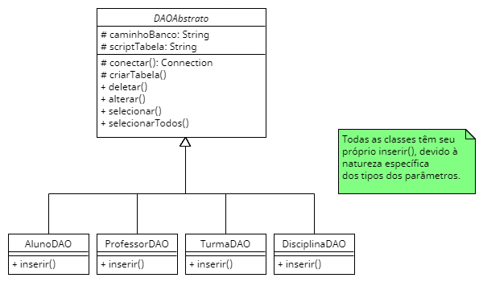
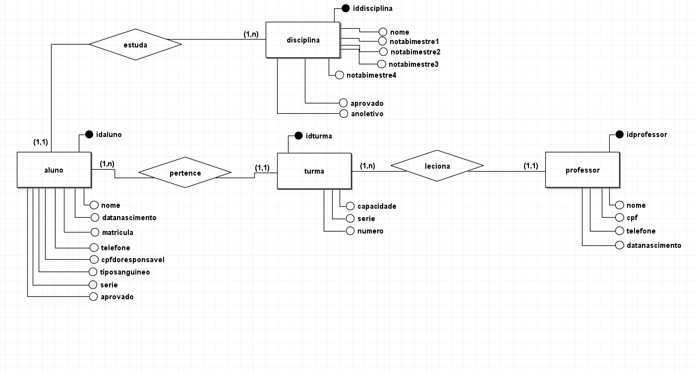
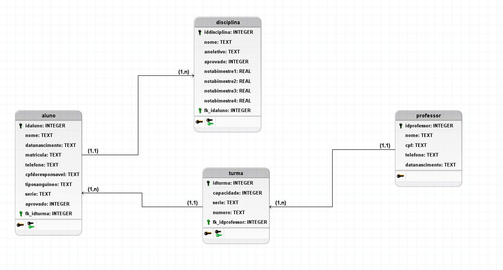

# Sistema de cadastro escolar
Trata-se de um sistema básico de cadastro de alunos para um escola implementado na linguagem Java.  
O banco de dados escolhido foi o SQLite, sendo acessado através de um driver pelo JDBC.  
Para a interface gráfica, foi escolhido o javafx.

## A fazer:
- Implementar todas as classes modeladas até o momento.
- Adicionar interface gráfica ao projeto.
- Modificar os diagramas.
- Implementar classes controladoras, que fazem o meio de campo entre as classes relacionandas ao banco e à GUI.
  - Implementar algoritmo para resgatar todas as disciplinas de um aluno.
  - Implementar algoritmo para resgator todos os alunos de uma turma.
  - Implementar algoritmo para resgatar todo o histórico de um aluno.
  - Implementar algoritmos para verificar se uma entidade já está no banco ao tentar inserí-la.

## Ideias adicionais (implementadas se haver tempo antes da entrega)
- Gráfico mostrando a performance do aluno com base no histórico.
- Embelezamento da interface gráfica.

## Coisas a serem implementadas
### Classes básicas
- [x] Classe Pessoa
- [x] Classe Aluno
- [x] Classe Professor
- [x] Classe Turma
- [x] Classe Disciplina
- [x] Classe Validacao
### Acesso ao banco de dados
- [x] Classe AlunoDAO
- [x] Classe ProfessorDAO
- [x] Classe TurmaDAO
- [x] Classe DisciplinaDAO
### Interface gráfica
- [ ] Tela incial
- [ ] Tela de cadastro de aluno
- [ ] Tela de cadastro de professor
- [ ] Tela de seleção de turmas
- [ ] Tela de listagem de alunos e professres de um turma
- [ ] Tela com informações do aluno
- [ ] Tela do histórico do aluno
- [ ] Tela com informações do professor

## UML das classes básicas:

## Classes de acesso ao banco de dados:

## Diagrama de entidades e relacionamentos:

## Diagrama lógico do banco de dados:

