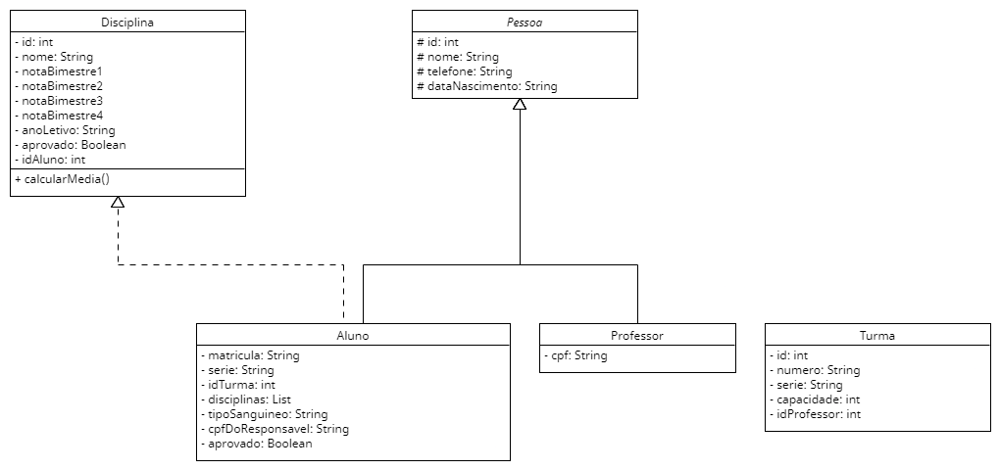

# Sistema de cadastro escolar
Trata-se de um sistema básico de cadastro de alunos para um escola implementado na linguagem Java.  
O banco de dados escolhido foi o SQLite, sendo acessado através de um driver pelo JDBC.  
Para a interface gráfica, foi escolhido o Swing.

## A fazer:
- Implementar todas as classes modeladas até o momento.
- Modificar os diagramas.
- Implementar algoritmo para resgatar todas as disciplinas de um aluno.
- Implementar algoritmo para resgator todos os alunos de uma turma.
## Coisas a serem implementadas:
### Classes básicas
- [x] Classe Pessoa
- [x] Classe Aluno
- [ ] Classe Professor
- [x] Classe Turma
- [x] Classe Disciplina
### Acesso ao banco de dados
- [x] Classe AlunoDAO
- [x] Classe ProfessorDAO
- [x] Classe TurmaDAO
- [x] Classe DisciplinaDAO

## UML das classes básicas:

## Classes de acesso ao banco de dados:

## Diagrama de entidades e relacionamentos:

## Diagrama lógico do banco de dados:

